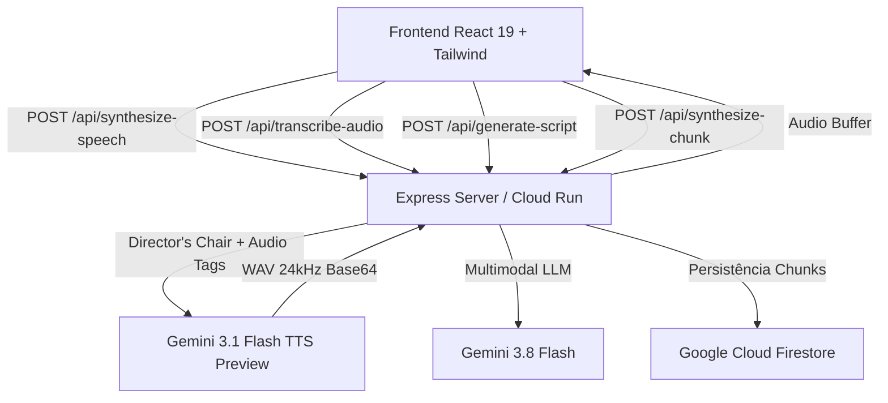

# MyTTS Studio (Speechify & ElevenLabs Inspired)

Estúdio de voz neural de altíssima fidelidade e usabilidade imediata baseado na **Gemini 3.1 Flash TTS Preview**, **Gemini 3.8 Flash** e **Gemini Live API**.

---

## 🚀 Funcionalidades Principais

1. **Leitor Neural Direto (Speechify / ElevenLabs Style)**:
   - Cole qualquer texto, ensaio ou artigo e ouça instantaneamente com vozes humanas expressivas.
   - **Director's Chair Prompting**: Controle dinâmico de tom, respiração e pausas naturais na fala.
   - Tags prosódicas de 1 clique: `[deep breath]`, `[sighs]`, `[pause]`, `[laughs]`, `[whispers]`.
   - Download direto do arquivo de áudio WAV (24kHz, 16-bit mono).
2. **Ditado por Microfone & Transcrição Inteligente**:
   - Grave sua voz diretamente pelo microfone do navegador.
   - O Gemini 3.8 estrutura, pontua e corrige o texto falado em parágrafos limpos.
   - Transferência em 1 clique para leitura imediata por qualquer voz neural.
3. **Biblioteca de Vozes Neurais**:
   - Catálogo com as vozes oficiais do Gemini: **Puck** (Enérgico/Provocador), **Kore** (Analítica/Teórica), **Aoede** (Calorosa/Narrativa), **Fenrir** (Grave/Solenidade) e **Enceladus** (Arejado/Contemplativo).
   - Audição de amostra de voz de 3 segundos em alta qualidade antes de selecionar.
4. **Estúdio de Debate Dialético (Dual Speaker)**:
   - Roteirizador dramatúrgico com inteligência artificial para debates com visões antagônicas a partir de PDFs ou documentos colados.
   - Player estéreo contínuo via Web Audio API.
5. **FastChunks (Treino de Idiomas)**:
   - Blocos lexicais da vida real (inglês, italiano, japonês) com guia fonético e repetição espaçada (*Shadowing loop*).
   - Síntese neural Gemini IA com cache em memória e fallback local.

---

## 📐 Diagrama de Funções e Arquitetura



---

## 🛠️ Tecnologias

- **Frontend**: React 19, TypeScript, Tailwind CSS v4, Motion, Lucide Icons, Plus Jakarta Sans & JetBrains Mono.
- **Backend**: Node.js 22, Express, `@google/genai` SDK v2.4+, `@google-cloud/firestore`.
- **Infraestrutura**: Google Cloud Run (Container multi-stage Linux), Google Cloud Build, GitHub Actions.
- **Modelos de IA**:
  - `gemini-3.1-flash-tts-preview`: Síntese neural de voz com Director's Chair.
  - `gemini-3.8-flash`: Roteirização, extração de PDFs e transcrição de áudio.
  - `gemini-3.1-flash-live-preview`: Conversação em tempo real (Fase 2).

---

## 💻 Execução Local

### Pré-requisitos
- Node.js >= 20
- Chave de API do Google Gemini (`GEMINI_API_KEY`)

### Instalação
```bash
# Instalar dependências
npm install

# Configurar variáveis de ambiente
cp .env.example .env
# Adicione sua GEMINI_API_KEY no arquivo .env

# Executar em modo desenvolvimento
npm run dev
```

Acesse [http://localhost:3000](http://localhost:3000).

---

## ☁️ Deploy no Google Cloud Run

O projeto conta com `Dockerfile` multi-stage otimizado para deploy em um comando:

```powershell
gcloud run deploy mytts `
  --source . `
  --region us-central1 `
  --allow-unauthenticated `
  --project agent-md-506215 `
  --set-env-vars="GEMINI_API_KEY=SUA_CHAVE,GCP_PROJECT_ID=agent-md-506215"
```

---

## 📄 Documentação Adicional

- [designe.md](./designe.md): Especificação arquitetural, fluxos de navegabilidade e design system.
