# SPEC.md - Especificação Funcional, Arquitetura e Navegabilidade (MyTTS Studio)

Este documento estabelece o mapeamento técnico completo, a arquitetura de interfaces, a navegabilidade de usuário (UX) e os contratos de API do **MyTTS Studio** (`mytts`), integrando os requisitos da skill `arquitetura-design-implementacao-sistema` e o `Design System Tátil Melki`.

---

## 1. Visão Geral e Intenção Prática

* **Objetivo do Sistema:** Estação neural de alta fidelidade para síntese de voz com respiração humana e prosódia orgânica (`gemini-3.1-flash-tts-preview`), ditado inteligente com pontuação ao vivo (`gemini-3.8-flash`), estúdio de debate dialético com duas vozes antagônicas, chat poliglota multimodal (inglês, italiano, japonês) com extração de blocos lexicais (*FastChunks*), e pós-produção multitrack com trilha procedural e auto-ducking dinâmico.
* **Público e Permissões:**
  * Usuários individuais, criadores de conteúdo, estudantes de idiomas e profissionais de mídia.
  * Autenticação leve baseada em sessão de dispositivo com header `X-User-Id` sanitizado e persistência no `localStorage` / Google Cloud Firestore.

---

## 2. Mapa de Navegabilidade (UX)

```mermaid
graph TD
    classDef main fill:#0f172a,stroke:#f59e0b,stroke-width:2px,color:#f8fafc;
    classDef sub fill:#1e293b,stroke:#475569,stroke-width:1px,color:#cbd5e1;
    classDef modal fill:#1e293b,stroke:#10b981,stroke-width:2px,color:#f8fafc;

    Nav["Sidebar Persistente (5 Módulos Principais)"]:::main
    
    Nav --> S1["1. Estúdio de Criação (Home / Leitor Solo)"]:::main
    Nav --> S2["2. Chat Poliglota (EN • IT • JA + Chunks)"]:::main
    Nav --> S3["3. Microfone & Ditado Ao Vivo"]:::main
    Nav --> S4["4. Estúdio de Debate (2 Vozes)"]:::main
    Nav --> S5["5. Biblioteca de Vozes (5 Timbres)"]:::main
    Nav --> M1["Modal de Arquitetura & Governança"]:::modal
    
    %% Fluxo Estúdio de Criação
    S1 --> S1_Edit["Editor de Texto / Upload PDF / MD / Ditar"]:::sub
    S1 --> S1_Voice["Grade Tátil de Vozes (Puck, Kore, Aoede, Fenrir, Enceladus)"]:::sub
    S1 --> S1_Prosody["Micro-Pontuação & Estilo pt-BR"]:::sub
    S1 --> Dock["Dock Inferior Multitrack (Thumb Zone)"]:::main
    
    %% Fluxo Chat Poliglota
    S2 --> S2_Input["Barra de Chat com Auto-Expansão"]:::sub
    S2 --> S2_Columns["3 Colunas Paralelas (EN, IT, JA) com Foco Tátil"]:::sub
    S2 --> S2_Audio["Player Trilogia & Controle por Idioma"]:::sub
    S2 --> M2["Modal de Exportação de Chunks (Anki, MD, JSON, Deck)"]:::modal
    S2 --> M3["Drawer Meu Deck (Flashcards Locais)"]:::modal
    
    %% Fluxo Ditado
    S3 --> S3_Mic["Esfera Reativa WebRTC"]:::sub
    S3 --> S3_Transcribe["Transcrição Estruturada Gemini 3.8"]:::sub
    S3 --> S1

    %% Fluxo Debate
    S4 --> S4_Script["Roteirizador Dramatúrgico Antagônico"]:::sub
    S4 --> S4_Player["Player Sequencial de Turnos"]:::sub
    S4 --> Dock

    %% Dock Inferior Global
    Dock --> Dock_Controls["Play/Pause 56px, Scrubber Sunken, Velocidade (0.8x a 2x)"]:::sub
    Dock --> Dock_Ducking["Auto-Ducking Dinâmico (-8dB, -14dB, -20dB)"]:::sub
    Dock --> Dock_Soundtrack["Trilhas Procedurais (Lo-Fi, 432Hz, Cinema, Tech)"]:::sub
    Dock --> Dock_Export["Exportação Master WAV RIFF 44.1kHz"]:::sub
```

---

## 3. Especificação de Funcionamento e Estados de Interface

| Módulo / Tela | Componentes de UI | Funcionamento e Regra de Negócio | Estados de Interface (4 Estados Canônicos) |
| :--- | :--- | :--- | :--- |
| **Estúdio de Criação** (`StudioWorkspace.tsx`) | Editor de Texto (`StudioTextEditor.tsx`), Grade de Vozes (`VoiceCardGrid.tsx`), Seletor de Estilo Prosódico, Botão de Ação Primária | Ingestão de texto/PDF com sanitização; seleção de voz ativa com preview de 3s; cálculo automático de respirações biológicas pt-BR. | • **Empty:** Placeholder convidativo com sugestões. • **Loading:** Ondas pulsantes âmbar durante síntese neural. • **Success:** Reprodução iniciada no Dock com scrubber ativo. • **Error:** Card de fallback com mensagem acionável e retry. |
| **Chat Poliglota Multimodal** (`PolyglotChatStudio.tsx`) | Barra de Input (`AgentInputDock.tsx`), 3 Colunas Paralelas (`LanguageColumnCard.tsx`), Player Flutuante (`FloatingCardAudioController.tsx`) | Alinhamento paralelo de sentenças e blocos lexicais nos idiomas EN, IT e JA; reprodução individual ou encadeada (trilogia). | • **Empty:** Guia de onboarding com sugestões de conversa. • **Loading:** Esqueleto de colunas com shimmer translúcido. • **Success:** Cards de chunks clicáveis com áudio individual. • **Error:** Banner inline sem perder o texto original digitado. |
| **Modal de Exportação** (`ExportInteractionModal.tsx`) | Seletor de 4 formatos (Anki CSV, Markdown, JSON, Injeção no Deck), Contagem de chunks, Botão Baixar/Salvar | Extração sob demanda dos pares de idioma; download imediato via Blob sem requisição de rede ou persistência local em flashcard. | • **Empty:** Aviso quando não há chunks válidos. • **Loading:** Spinner discreto no botão de download. • **Success:** Confirmação com toast e auto-fechamento. • **Error:** Alerta de falha de escrita no armazenamento local. |
| **Ditado & Microfone IA** (`LiveVoiceMic.tsx`) | Botão de gravação 56px, Esfera pulsante de áudio, Área de texto transcrito, Ação "Enviar ao Leitor" | Captura áudio via MediaRecorder API; streaming seguro para o backend; pontuação inteligente via Gemini 3.8 Flash. | • **Empty:** Microfone em standby com micro-instrução. • **Loading (Recording/Transcribing):** Ondas reativas âmbar. • **Success:** Texto transcrito com botão de inserção no leitor. • **Error:** Aviso de permissão negada de microfone ou erro de rede. |
| **Estúdio de Debate 2 Vozes** (`DebateConfigPanel.tsx`, `ScriptViewer.tsx`) | Ingestão de tema/PDF, Seletor de intensidade dialética, Feed de cards de oradores com avatares distintos | Gera roteiro dramático antagônico sem concordâncias falsas; sintetiza turnos com alternância de timbres e prosódia equilibrada. | • **Empty:** Formulário com campo de tema e upload de documento. • **Loading:** Roteirizando debate com Gemini 3.8 Flash. • **Success:** Roteiro montado com player de áudio multi-turnos. • **Error:** Card de erro com opção de reescrever com prompt alternativo. |
| **Dock de Áudio Inferior** (`BottomAudioDock.tsx`) | Botão Play/Pause 56px, Scrubber Range Slider Sunken, Seletor de Velocidade (0.8x a 2.0x), Gaveta Trilha Sonora | Grafo multitrack unificado na Web Audio API; ganho vocal com auto-ducking exponencial da música de fundo; renderizador offline. | • **Empty (Idle):** Barra retraída ou em espera discreta. • **Loading (Buffering):** Equalizador de pulso contínuo. • **Success (Playing):** Ondas dinâmicas animadas em tempo real. • **Error:** Fallback automático para reprodução do próximo turno. |

---

## 4. Plano de Implementação e Arquitetura Técnica

### 4.1. Fases Cronológicas de Entrega
* **Fase 1 (MVP Neural - Concluída):**
  * Integração com `gemini-3.1-flash-tts-preview` e `gemini-3.8-flash`.
  * Conversor canônico de container WAV RIFF de 44 bytes para bytes PCM brutos.
  * Player gapless com suporte a velocidade de reprodução com pitch preservado.
* **Fase 2 (Estúdio Multitrack & Chat Poliglota - Concluída):**
  * Trilhas musicais procedurais geradas via `OfflineAudioContext` (sem downloads externos).
  * Auto-ducking dinâmico em tempo real com envelopes de ataque (100ms) e release (450ms).
  * Chat Poliglota em 3 línguas com extração de blocos lexicais e modal de exportação multi-formato (Anki, MD, JSON).
* **Fase 3 (Refinamento Tátil Melki & Produtividade - Concluída):**
  * Paleta mineral e tokens táteis integrados no `index.css` (`--elevation-card`, `--rim-light`, `.input-sunken`).
  * Command Palette tátil com atalho global `Ctrl + K` (`CommandPaletteModal.tsx`), filtro rápido e navegação por setas.
  * Artefato interativo de referência com os 5 arquétipos canônicos (`mockup_tatil_referencia.html`).
* **Fase 4 (Próximos Passos & Expansão Cognitiva):**
  * Cache estendido offline com persistência no IndexedDB para áudios sintetizados.
  * Suporte a atalhos de playback globais (`Espaço` para Play/Pause, `J`/`L` para avanço/recuo de 5s).
  * Ingestão direta de URLs de artigos web para conversão em debates instantâneos.

### 4.2. Contratos de Rotas e Endpoints REST

| Método | Endpoint | Entrada Principal | Resposta / Payload |
| :--- | :--- | :--- | :--- |
| `POST` | `/api/synthesize-speech` | `{ text: string, voiceName: string, stylePrompt?: string }` | `{ audioContent: string (base64 WAV RIFF) }` |
| `POST` | `/api/preview-voice` | `{ voiceName: string }` | `{ audioContent: string (base64 WAV 3s) }` |
| `POST` | `/api/transcribe-audio` | `multipart/form-data` ou `{ audioBase64: string, mimeType: string }` | `{ text: string }` |
| `POST` | `/api/extract-text` | `FormData` com PDF/TXT/MD | `{ text: string, title?: string }` |
| `POST` | `/api/generate-script` | `{ sourceText: string, intensity: string }` | `{ title: string, turns: Turn[] }` |
| `POST` | `/api/synthesize-turn` | `{ speaker: string, text: string, voiceName: string }` | `{ audioContent: string (base64 WAV) }` |
| `POST` | `/api/translate-parallel-chunks` | `{ text: string, context?: string }` | `{ en: ParallelChunk, it: ParallelChunk, ja: ParallelChunk }` |
| `GET` | `/api/health` | Nenhuma | `{ status: "online", models: object, uptime: number }` |

---

## 5. Matriz de Discrepâncias com as Preferências Melki

| Critério de Preferência | Status Determinístico | Evidência / Observação |
| :--- | :---: | :--- |
| **Paleta Mineral Anti-Cobalto (DISC-01)** | `[PASS]` | Uso estrito de Slate Navy, ardósia `#020617` e âmbar `#f59e0b`; zero cobalto neon. |
| **Profundidade Dark Mode (DISC-02)** | `[PASS]` | Cartões `rgba(15, 23, 42, 0.88)` mais claros que canvas `#020617` (`L_card > L_canvas`). |
| **Sombras Multicamadas (DISC-03)** | `[PASS]` | Sombra oclusiva próxima + projeção difusa ampla com oclusão volumétrica. |
| **Rim Light Zenital (DISC-04)** | `[PASS]` | Micro-chanfro óptico refletivo `inset 0 1px 0 0 rgba(255, 255, 255, 0.10)` ativo nos cartões. |
| **Anti-Glassmorphism (DISC-05)** | `[PASS]` | Superfícies ardósia foscas de alta solidez, sem blur transparente agressivo. |
| **Anti-Squish em Botões/Tags (DISC-06)** | `[PASS]` | Blindagem com `flex-shrink: 0; white-space: nowrap;` em todas as ações e badges. |
| **Ergonomia e Suporte a TDAH (DISC-07)** | `[PASS]` | Atalho `Ctrl+K` global para Command Palette, ausência total de `alert()` bloqueante. |
| **Componentes Modulares Copy-Paste (DISC-08)** | `[PASS]` | Padrão desacoplado (Tailwind v4, Radix/shadcn-style, Lucide Icons e Google Icons). |

---

## 6. Checklist de Aceite e Qualidade

* [x] **Zero Mocks Circulares:** Todos os testes unitários (`npm test`) validam cálculos matemáticos reais de dB, montagem de headers RIFF e geradores de arquivo (Anki CSV, Markdown, JSON).
* [x] **Execução Auditável:** Código compilado com sucesso (`npm run build`), verificação estrita de tipos sem erros (`npm run lint`).
* [x] **Nenhum Beco Sem Saída de Navegação:** Todas as 5 abas e modais possuem ações explícitas de retorno, cancelamento e transições limpas.
* [x] **4 Estados de Interface Definidos:** Especificação formal de Empty, Loading, Success e Error para todos os módulos críticos.
* [x] **Regra de Ouro da Profundidade Tátil:** `L_card > L_canvas` comprovada no DOM (`rgba(15, 23, 42, 0.88)` sobre `#020617`).
* [x] **Anti-Cobalto Respeitado:** Zero presença de azuis agressivos ou cores saturadas desconfortáveis.
