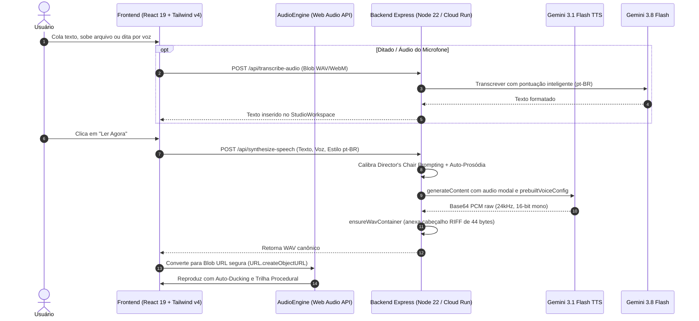

# Especificação de Design, Arquitetura e Navegabilidade (MyTTS Studio)

Este documento estabelece o design system, a arquitetura de interfaces e o plano funcional e ergonômico do **MyTTS Studio**, alinhado aos padrões visuais de referências globais como **Speechify** e **ElevenLabs**, potencializado pelos modelos neurais **Gemini 3.1 Flash TTS Preview**, **Gemini 3.8 Flash** e **Web Audio API**.

---

## 1. Visão Geral e Intenção Prática

* **Objetivo do Sistema:** Prover uma estação de trabalho de áudio neural de altíssima fidelidade e usabilidade imediata (*zero-friction*), permitindo aos usuários colar qualquer texto e ouvir instantaneamente com vozes humanas realistas (respiração, pausas, tom e emoção), gravar áudio pelo microfone para ditado inteligente, sintetizar debates com dois oradores de IA, treinar idiomas com repetição espaçada (*FastChunks*) e exportar master profissional com trilhas sonoras procedurais e auto-ducking dinâmico.
* **Público e Permissões:**
  * Usuários individuais, estudantes, podcasters e profissionais que necessitam de leitura de alta velocidade e síntese de áudio de estúdio.
  * Acesso aberto com autenticação baseada em sessão de dispositivo (`X-User-Id`), sem barreiras de onboarding.

---

## 2. Mapa de Navegabilidade e Arquitetura de UX

A aplicação adota o padrão canônico de **Sidebar Lateral Persistente + Canvas de Trabalho Focado + Thumb-Zone Dock Inferior**:

```mermaid
graph TD
    A["Sidebar Persistente"] --> B["1. Studio Unificado / Home"]
    A --> C["2. Ditado & Microfone IA"]
    A --> D["3. Estúdio Dialético (Debate 2 Vozes)"]
    A --> E["4. FastChunks (Treino de Idiomas)"]
    A --> F["5. Biblioteca de Vozes (Voice Library)"]
    A --> G["6. Arquitetura & Governança"]
    
    B --> B1["Editor Focado (Colar / Upload PDF / MD / TXT)"]
    B --> B2["Alternância Ágil: Solo (1 Voz) vs Conversa (2 Vozes)"]
    B --> B3["Micro-Pontuação de Auto-Prosódia (pt-BR)"]
    B --> B4["Grade Tátil de Vozes Neurais com Preview 3s"]
    
    C --> C1["Gravação via Microfone WebRTC"]
    C --> C2["Transcrição Neural com Pontuação Gemini 3.8"]
    C --> C3["Transferência Instantânea para o Leitor"]
    
    D --> D1["Ingestão de Artigo ou Ensaio"]
    D --> D2["Roteirização Dramatúrgica Antagônica"]
    D --> D3["Player Estéreo de Debate"]
    
    E --> E1["Seleção de Idioma (EN / IT / JA)"]
    E --> E2["Treino por Shadowing Loop"]
    E --> E3["Síntese Neural de Cada Bloco"]

    B --> H["Dock de Áudio Inferior (Thumb Zone)"]
    D --> H
    H --> H1["Scrubber & Preservação de Pitch"]
    H --> H2["Trilhas Sonoras Procedurais (Lo-Fi, 432Hz, Cinemático, Tech)"]
    H --> H3["Auto-Ducking Dinâmico (-8dB, -14dB, -20dB)"]
    H --> H4["Exportação de Master WAV RIFF Estéreo"]
```

---

## 3. Diagrama de Fluxo de Dados do Sistema

---

## 4. Especificação de Componentes e Estados de Interface

| Módulo / Tela | Componentes de UI | Comportamento e Regra de Negócio | Estados de Interface |
| :--- | :--- | :--- | :--- |
| **Sidebar Lateral** | Brand Logo, 6 Botões de Módulo com badges e ícones Lucide, Indicador Cloud Run | Alterna instantaneamente o canvas ativo via View Transitions API sem recarregar a página | Active, Inactive, Hover, Mobile Drawer |
| **Studio Workspace (Home)** | Central Unificada (`StudioWorkspace.tsx`), Editor de Texto (`StudioTextEditor.tsx`), Seletor de Modo (Solo vs Conversa), Seletor de Presets Prosódicos | Permite entrada rápida por digitação, drag-and-drop de PDFs/TXTs/MDs ou ditado, com persistência total entre trocas de modo | Empty (placeholder receptivo), Typing, Synthesizing (pulsing wave), Playing, Error |
| **Grade de Vozes (`VoiceCardGrid`)** | Grid com 5 cards táticos (Puck, Kore, Fenrir, Aoede, Enceladus), Botão preview de 3s no card, Indicador de timbre e gênero | Permite audição imediata de cada voz; suporte a acessibilidade (`tabIndex={0}`, `role="radio"`) e revogação atômica de URLs | Idle, Previewing (spinner/onda no card), Selected |
| **Dock de Áudio Inferior** | Botão Play/Pause (56px touch target), Scrubber de progresso, Seletor de velocidade (0.8x a 2.0x), Gaveta expansível (Voz & Trilha Sonora), Exportador Master WAV | Persistente em todas as abas; controla grafo multitrack (voz + trilha procedural + auto-ducking dinâmico) | Idle, Buffering, Playing (ondas sonoras reativas), Paused |
| **Ditado & Voz ao Vivo** | Esfera visual reativa animada, Botão de gravação com timer, Campo de transcrição inteligente, Botão "Enviar ao Leitor" | Captura áudio do microfone do usuário e transcreve com pontuação estruturada via Gemini 3.8 | Standby, Recording (onda reativa vermelha/âmbar), Transcribing, Done |
| **Estúdio Dialético** | Visualizador de roteiro em cards alternados com avatares dos 2 oradores, Painel de configuração de intensidade de debate | Roteiriza embates filosóficos e práticos a partir de qualquer PDF/texto com diretrizes anti-clichê | Empty, Script Generating, Audio Synthesizing, Ready |
| **FastChunks** | Grid de blocos coloquiais, Seletor de idioma tátil (EN, IT, JA), Modo Drill (Shadowing Loop), Síntese neural Gemini | Treino auditivo de frases com entonação nativa, repetição espaçada e persistência no Firestore | Loading Chunks, Card Idle, Drilling, Neural Synthesizing |

---

## 5. Design System e Identidade Visual

### 5.1. Paleta de Cores
- **Superfície Primária (`Background`)**: `slate-950` (`#020617`) para contraste profundo e imersão estilo ElevenLabs.
- **Superfície Secundária (`Card / Canvas`)**: `slate-900` (`#0f172a`) com bordas em `slate-800/80` (`#1e293b`).
- **Acento Primário (`Primary Accent`)**: `amber-400` / `amber-500` (dourado estúdio) para ações de destaque (Play, Gerar, Ler Agora).
- **Acento Secundário (`Voz & Sucesso`)**: `emerald-400` / `emerald-500` para status online, reprodução e confirmações.
- **Tipografia**: `Plus Jakarta Sans` para textos corridos, títulos e botões; `JetBrains Mono` para durações, velocidades e indicadores técnicos.

### 5.2. Padrões de Microinteração e Acessibilidade
- **Área Tátil (Touch Targets)**: Altura e largura mínimas de 44px a 56px para botões primários no dock inferior e cards de ação rápida.
- **Micro-Pontuação Orgânica**: Substituição de tags textuais explícitas por micro-pausas e elipses acústicas (`...`, `—`), garantindo que o modelo não vocalize marcações.
- **Feedback Auditivo e Visual**: Barras de equalizador animadas no dock inferior sincronizadas com o estado de reprodução.

---

## 6. Endpoints do Sistema (Backend REST)

* `POST /api/synthesize-speech` — Síntese neural de texto corrido com calibração Director's Chair e garantia de container WAV RIFF.
* `POST /api/preview-voice` — Amostra rápida de 3 segundos de qualquer uma das 5 vozes neurais.
* `POST /api/transcribe-audio` — Transcrição neural de áudio do microfone via Gemini 3.8 com pontuação inteligente.
* `POST /api/extract-text` — Extração e parsing multimodal de arquivos PDF, TXT ou Markdown.
* `POST /api/generate-script` — Roteirizador dramatúrgico de debates dialéticos.
* `POST /api/synthesize-turn` — Síntese de turno individual do estúdio de debate.
* `POST /api/synthesize-full` — Geração do episódio completo em master de duas vozes.
* `POST /api/mix-audio` — Mixagem broadcast no servidor via FFmpeg com compressor sidechain nativo.
* `POST /api/synthesize-chunk` — Síntese de bloco coloquial de idioma para o FastChunks.
* `GET /api/chunks` — Recuperação de chunks do Firestore.
* `GET /api/health` — Monitoramento de integridade e versões de modelo.
