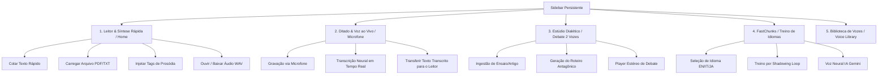
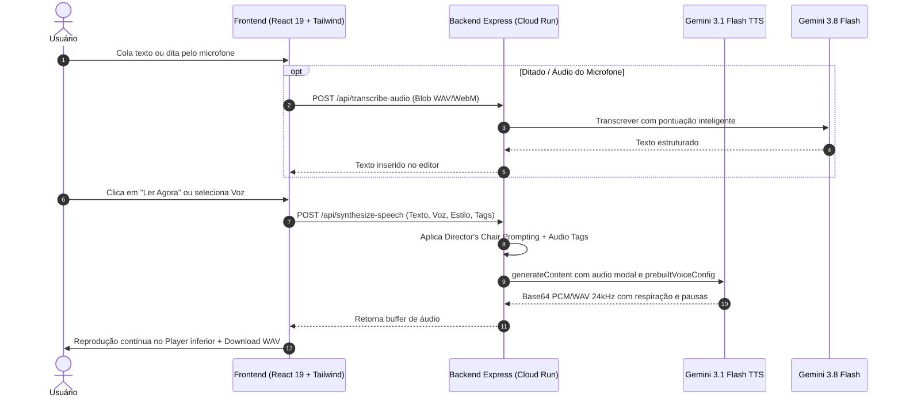

# Especificação de Design, Arquitetura e Navegabilidade (designe.md)

Este documento estabelece o design system, a arquitetura de interfaces e o plano funcional do **MyTTS Studio**, alinhado aos padrões visuais e ergonômicos de referências globais da indústria como **Speechify** e **ElevenLabs**, potencializado pelos modelos neurais **Gemini 3.1 Flash TTS Preview**, **Gemini 3.8 Flash** e **Gemini Live API**.

---

## 1. Visão Geral e Intenção Prática

* **Objetivo do Sistema:** Prover uma estação de trabalho de áudio neural de altíssima fidelidade e usabilidade imediata ("zero-friction"), permitindo aos usuários colar qualquer texto e ouvir instantaneamente com vozes humanas realistas (respiração, pausas, tom e emoção), gravar áudio pelo microfone para ditado ou conversação bidirecional, sintetizar debates com dois oradores de IA e treinar idiomas com repetição espaçada (*FastChunks*).
* **Público e Permissões:**
  * Usuários individuais, estudantes, podcasters e profissionais que necessitam de leitura de alta velocidade e síntese de áudio de estúdio.
  * Acesso aberto com autenticação baseada em sessão de dispositivo (`X-User-Id`), sem barreiras de onboarding.

---

## 2. Mapa de Navegabilidade e Arquitetura de UX

A aplicação adota o padrão canônico de **Sidebar Lateral Persistente + Canvas de Trabalho Focado**:

---

## 3. Diagrama de Funções e Fluxo de Dados do Sistema

---

## 4. Especificação de Componentes e Estados de Interface

| Módulo / Tela | Componentes de UI | Comportamento e Regra de Negócio | Estados de Interface |
| :--- | :--- | :--- | :--- |
| **Sidebar Lateral** | Brand Logo, 5 Botões de Módulo com badges, Seletor de Tema, Status Cloud Run | Alterna instantaneamente o canvas ativo via View Transitions API sem recarregar a página | Active, Inactive, Hover, Mobile Drawer |
| **Leitor Rápido (Home)** | Editor de Texto amplo, Ações de cabeçalho (Colar, Limpar, Upload, Microfone), Barra de Tags Prosódicas (`[sighs]`, `[pause]`, `[deep breath]`), Botão Hero "Ler Agora" | Converte texto cru em áudio neural com 1 clique; estima tempo de leitura (~150 ppm) | Empty (placeholder elegante), Typing, Synthesizing (pulsing wave), Playing, Error |
| **Dock de Áudio Inferior** | Botão Play/Pause grande, Barra de progresso deslizável com scrubber, Seletor de velocidade (0.8x a 2.0x), Botão Download WAV, Visualizador de onda sonora | Persistente em todas as abas; toca áudio em 24kHz sem travar a navegação | Idle, Buffering, Playing (ondas animadas), Paused |
| **Voz ao Vivo & Mic** | Esfera visual reativa animada, Botão de gravação com timer, Campo de transcrição ao vivo, Botão "Enviar ao Leitor" | Captura áudio do microfone do usuário e transcreve automaticamente | Standby, Recording (onda reativa vermelha/âmbar), Transcribing, Done |
| **Biblioteca de Vozes** | Grid de cards de vozes (Puck, Kore, Fenrir, Aoede, Enceladus, etc.), Botão preview de 3s, Indicador de tom/timbre | Permite ao usuário ouvir amostras de cada voz antes de selecionar | Idle, Previewing (spinner/onda no card), Selected |
| **Estúdio Dialético** | Visualizador de roteiro em cards alternados com avatares dos 2 oradores, Painel de configuração de intensidade de debate | Roteiriza embates filosóficos e práticos a partir de qualquer PDF/texto | Empty, Script Generating, Audio Synthesizing, Ready |
| **FastChunks** | Grid de blocos coloquiais, Seletor de idioma tátil, Modo Drill (Shadowing), Botão Voz Neural IA | Treino auditivo de frases com entonação nativa e repetição espaçada | Loading Chunks, Card Idle, Drilling, Neural Synthesizing |

---

## 5. Design System e Identidade Visual (Inspirado em ElevenLabs / Speechify)

### 5.1. Paleta de Cores
- **Superfície Primária (`Background`)**: `slate-950` (`#020617`) para contraste profundo e imersão.
- **Superfície Secundária (`Card / Canvas`)**: `slate-900` (`#0f172a`) com bordas em `slate-800/80` (`#1e293b`).
- **Acento Primário (`Primary Accent`)**: `amber-400` / `amber-500` (dourado estúdio) para ações de destaque (Play, Gerar, Tags).
- **Acento Secundário (`Voz & Sucesso`)**: `emerald-400` / `emerald-500` para status online, reprodução e áudio pronto.
- **Tipografia**: `Plus Jakarta Sans` para textos, títulos e botões; `JetBrains Mono` para durações, velocidades e tags de prosódia.

### 5.2. Padrões de Microinteração
- **Botões de Ação**: Altura mínima de 44px (touch target ergonômico), bordas arredondadas `rounded-xl`, efeito `active:scale-95`.
- **Feedback Auditivo**: Ondas sonoras verticais com animação CSS suave (`animate-pulse` e bar scales dinâmicos) durante a fala.

---

## 6. Endpoints do Sistema (Backend REST)

* `POST /api/synthesize-speech` — Síntese direta de texto corrido com Director's Chair, pausas e respiração.
* `POST /api/transcribe-audio` — Transcrição neural de gravação de microfone (Gemini 3.8).
* `POST /api/extract-text` — Extração de texto de PDF ou arquivos colados.
* `POST /api/preview-voice` — Amostra rápida de 3 segundos de qualquer voz neural.
* `POST /api/synthesize-turn` — Síntese de turno individual do estúdio de debate.
* `POST /api/synthesize-full` — Geração do episódio completo em master de duas vozes.
* `POST /api/generate-script` — Roteirizador dialético com Gemini 3.8.
* `POST /api/synthesize-chunk` — Síntese de bloco de idioma para o FastChunks.
* `GET /api/chunks` — Recuperação de chunks do repositório/Firestore.
* `GET /api/health` — Monitoramento de integridade e versões de modelo.
