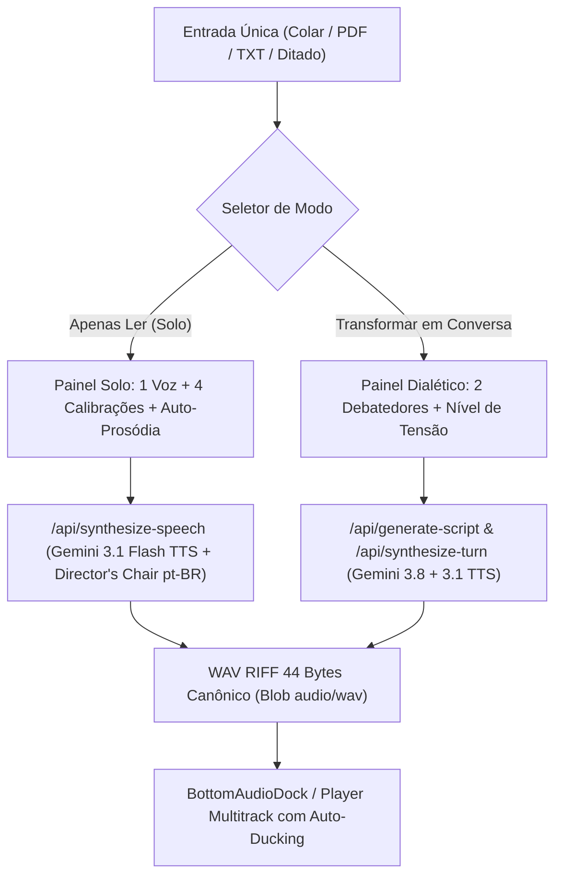

# Especificação de Design: Central de Criação Unificada & Auto-Prosódia

- **Data**: 2026-10-01 (Revisado com Feedback Técnico)
- **Status**: Aprovado
- **Autor**: Engenharia MyTTS Studio
- **Projeto**: MyTTS Studio (`mytts`)

---

## 1. Contexto e Problema de Engenharia

Atualmente, o **MyTTS Studio** apresenta uma divisão fragmentada entre módulos de síntese:
1. **Dispersão de Entrada**: A ingestão de texto e upload de documentos (PDF/TXT) ocorre de forma duplicada e desconectada entre o `QuickReader` e a `DocumentInputSection` do `DebateStudio`.
2. **Fricção na Seleção de Vozes**: O seletor de voz reside em menus suspensos (`<select>`) de baixa visibilidade, sem cartões táteis ou visualização rápida das 5 vozes neurais (Puck, Kore, Aoede, Fenrir, Enceladus).
3. **Calibração Artificial e Risco de Leitura de Tags**:
   - O sistema utilizava diretrizes de emoção em inglês desvinculadas da fonética brasileira e não aplicava a velocidade (`speed`).
   - Tags brutas no texto (ex: `[deep breath]`, `[pause]`) correm sério risco de serem lidas em voz alta pela IA como palavras se o modelo não as interpretar como tokens de controle acústico.
4. **Sobrecarga Cognitiva no Fôlego**: O usuário era obrigado a editar marcações manuais para dar ritmo à fala, gerando atrito e poluição visual.

---

## 2. Objetivos e Critérios de Sucesso

- **Central de Ingestão Única**: Uma única área de trabalho no topo que aceita texto colado, arrastar/subir arquivos (PDF, TXT, MD) ou ditado por voz.
- **Bifurcação de Modo em 1 Toque**: Alternar instantaneamente entre **"Apenas Ler (Solo)"** e **"Transformar em Conversa (2 Vozes)"** sem recarregar nem perder o conteúdo digitado.
- **Seletor de Vozes Ergonômico**: Cards visuais das 5 vozes neurais com miniatura, arquétipo, gênero e pré-escuta de 3 segundos embutida diretamente no card com acessibilidade total (navegação por teclado e `aria-label`).
- **4 Novos Modos de Calibração com Forçamento Estrito de PT-BR e Velocidade**:
  - `natural` (Natural & Fluido - padrão).
  - `storytelling` (Narrativo & Envolvente - estilo audiolivro).
  - `technical` (Técnico & Notícia - dicção clara e objetiva).
  - `spontaneous` (Espontâneo & Conversa - tom coloquial e ágil).
- **Auto-Prosódia Baseada em Pontuação Acústica e Prompting**:
  - Elimina a injeção cega de tags textuais literais para evitar que a IA as pronuncie.
  - Utiliza micro-pontuação natural (reticências `...`, travessões `—` e quebras de parágrafo) e capacidade pulmonar humana calibrada em orações (> 25 palavras) combinada com diretrizes fortes de palco no Director's Chair.

---

## 3. Arquitetura de Componentes e Fluxo de Dados



---

## 4. Detalhamento dos Componentes

### 4.1. Central de Criação (`StudioWorkspace.tsx`)
Substitui a visualização antiga por um espaço de trabalho coeso:
- **Header de Modos**: Duas abas superiores táteis com altura mínima de 44px e foco por teclado:
  - `🎙️ Apenas Ler (Solo)`
  - `👥 Transformar em Conversa (2 Vozes)`
- **Editor Central**:
  - Textarea responsivo com suporte a drag-and-drop de arquivos e sanitização de texto sujo.
  - Barra de ações rápidas: Colar da Área de Transferência, Carregar Arquivo (PDF/TXT/MD), Ditar e Limpar.
  - Indicador de palavras e estimativa de tempo em minutos de fala.
- **Grade de Cards de Voz**:
  - Cards visuais para Kore, Puck, Aoede, Fenrir e Enceladus com mini-player de teste (3s) e tecla de atalho.
- **Seletor de Intenção e Calibração**:
  - 4 botões de estilo com ícones e velocidade mapeada de 0.8x a 1.5x.

### 4.2. Calibração e Director's Chair no Backend (`server.ts`)
Refatoração da função `getEmotionStyle` com mapeamento explícito de velocidade e instrução mandatória de língua portuguesa:

```typescript
function getEmotionStyle(emotion: string, speed: number = 1.0): string {
  const speedAdj =
    speed < 0.9 ? 'slow, deliberate and well-paced' :
    speed > 1.1 ? 'agile, fast and energetic' :
    'natural and steady-paced';

  const langInstruction = 'Speak strictly in natural Brazilian Portuguese (pt-BR). ';

  switch (emotion) {
    case 'storytelling':
      return `${langInstruction}Warm storytelling cadence, ${speedAdj} rhythm, rich expressive timbre, thoughtful pauses before key concepts, and natural vocal modulation as in a high-end audiobook. Take subtle breath intakes naturally at punctuation.`;
    case 'technical':
      return `${langInstruction}Crystal clear diction, ${speedAdj} professional and grounded rhythm, steady breathing, authoritative articulation without theatrical melodrama. Maintain crisp pronunciation.`;
    case 'spontaneous':
      return `${langInstruction}Agile colloquial cadence, ${speedAdj} friendly inflections, subtle conversational hesitations, and warm energetic presence like a casual podcast dialogue.`;
    case 'natural':
    default:
      return `${langInstruction}Human, balanced, and fluent delivery with subtle breath intakes before long clauses, ${speedAdj} organic rhythm, and natural Brazilian Portuguese prosody.`;
  }
}
```

### 4.3. Algoritmo de Auto-Prosódia e Cadência Natural
Para evitar o risco gravíssimo do modelo ler tags literais em voz alta:
1. **Pontuação Acústica Natural**: Em vez de injetar `[deep breath]` ou `[pause]` no texto, o pré-processador normaliza a pontuação sintática:
   - Quebras de parágrafo recebem quebras reais de linha com espaçamento duplo.
   - Frases extensas (> 25 palavras) sem pausa recebem travessões (`—`) ou reticências (`...`) nas vírgulas estratégicas, sinalizando organicamente ao modelo LLM uma parada para fôlego.
2. **Director's Chair Implícito**: O prompt de direção comanda explicitamente a respiração e a cadência humana, deixando o texto limpo e legível.

---

## 5. Resiliência e Salvaguardas

- **Container Canônico e MIME Type Estrito**: Todo áudio gerado pelo backend é encapsulado no container WAV RIFF canônico de 44 bytes (24kHz 16-bit mono) e convertido no cliente com MIME type estrito `'audio/wav'`.
- **Gerenciamento de Memória**: Descarte atômico de URLs Blob antigas via `URL.revokeObjectURL(url)` para evitar vazamentos na reprodução de previews de 3 segundos e na troca de turnos.
- **Degradação Suave (Fallback Estruturado)**:
  - Se a API do Gemini TTS retornar erro de quota ou timeout:
    1. O erro é capturado e exibido em um banner visual com botão de "Tentar Novamente".
    2. O texto digitado pelo usuário é 100% preservado no estado local.
    3. Um botão de contingência "Ouvir com voz local do navegador" é disponibilizado como fallback opcional (Web Speech API) sem bloquear o fluxo de trabalho.

---

## 6. Plano de Testes e Casos de Borda

1. **Tipagem e Build Estritos**:
   - `npm run lint` (`tsc --noEmit`): Validação de tipos sem erros.
   - `npm run build`: Compilação de produção via Vite sem falhas.
2. **Motor de Áudio**:
   - `npm test` (`tsx test-audio-engine.ts`): Bateria automatizada de cálculos de ganho, ducking e cabeçalhos WAV RIFF de 44 bytes.
3. **Casos de Borda Críticos (Edge Cases)**:
   - **Texto Sujo**: Ingestão de texto com emojis (ex: 🚀🎙️), valores monetários formatados (`R$ 1.500,00`), URLs (`https://...`) e pequenos trechos de código (`console.log()`), validando que a síntese não trava nem soletra símbolos bizarros.
   - **Chunking de Textos Longos**: Documentos extensos divididos por parágrafos para síntese sequencial limpa, sem cortes bruscos no meio de palavras.
   - **Acessibilidade (a11y)**: Navegação por teclado (`Tab`, `Shift+Tab`, `Enter`, `Space`) em todos os cards de voz e botões primários, com atributos `aria-label` e estados de foco visíveis (`focus-visible`).
