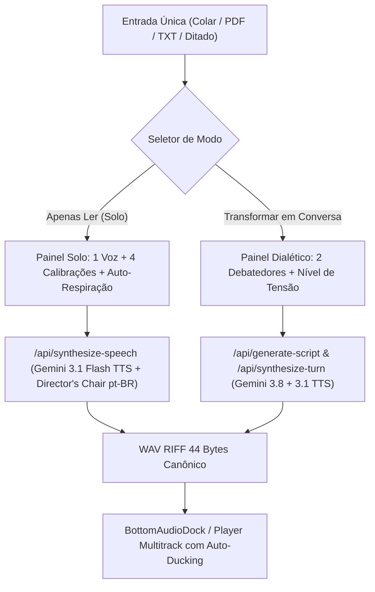

# Especificação de Design: Central de Criação Unificada & Auto-Prosódia

- **Data**: 2026-10-01
- **Status**: Aprovado
- **Autor**: Engenharia MyTTS Studio
- **Projeto**: MyTTS Studio (`mytts`)

---

## 1. Contexto e Problema de Engenharia

Atualmente, o **MyTTS Studio** apresenta uma divisão fragmentada entre módulos de síntese:
1. **Dispersão de Entrada**: A ingestão de texto e upload de documentos (PDF/TXT) ocorre de forma duplicada e desconectada entre o `QuickReader` e a `DocumentInputSection` do `DebateStudio`.
2. **Fricção na Seleção de Vozes**: O seletor de voz reside em menus suspensos (`<select>`) de baixa visibilidade, sem cartões táteis ou visualização rápida das 5 vozes neurais (Puck, Kore, Aoede, Fenrir, Enceladus).
3. **Calibração Artificial e Teatral**: O sistema utilizava diretrizes de emoção em inglês (como *"ironic chuckles"*, *"skeptical sighs"*), que ao serem traduzidas para a fonética e ritmo do português brasileiro geravam entonações exageradas ou robóticas.
4. **Prosódia Manual Obrigatória**: Para obter fôlego e pausas naturais, o usuário era obrigado a injetar manualmente marcações como `[deep breath]` e `[pause]`, gerando sobrecarga cognitiva e poluição visual no texto.

---

## 2. Objetivos e Critérios de Sucesso

- **Central de Ingestão Única**: Uma única área de trabalho no topo que aceita texto colado, arrastar/subir arquivos (PDF, TXT, MD) ou ditado por voz.
- **Bifurcação de Modo em 1 Toque**: Alternar instantaneamente entre **"Apenas Ler (Solo)"** e **"Transformar em Conversa (2 Vozes)"** sem recarregar nem perder o conteúdo digitado.
- **Seletor de Vozes Ergonômico**: Cards visuais das 5 vozes neurais com miniatura, arquétipo, gênero e pré-escuta de 3 segundos embutida diretamente no card.
- **4 Novos Modos de Calibração em Português**:
  - `natural` (Natural & Fluido - padrão).
  - `storytelling` (Narrativo & Envolvente - estilo audiolivro).
  - `technical` (Técnico & Notícia - dicção clara e objetiva).
  - `spontaneous` (Espontâneo & Conversa - tom coloquial e ágil).
- **Auto-Respiração e Pausas Baseadas no Conteúdo**:
  - O pipeline de áudio calcula automaticamente a capacidade pulmonar humana (média de 12 a 18 palavras por expiração) e quebras sintáticas (vírgulas, dois-pontos, parágrafos), aplicando respiração e pausas naturais sem poluir o texto original do usuário.
  - Interruptor transparente `[✓] Respiração e Pausas Naturais (IA)` com opção de auditoria de marcações.

---

## 3. Arquitetura de Componentes e Fluxo de Dados



---

## 4. Detalhamento dos Componentes

### 4.1. Central de Criação (`StudioWorkspace.tsx`)
Substitui a visualização antiga do leitor monolítico por um espaço de trabalho coeso:
- **Header de Modos**: Duas abas superiores com ícones nítidos:
  - `🎙️ Apenas Ler (Solo)`
  - `👥 Transformar em Conversa (2 Vozes)`
- **Editor Central**:
  - Textarea amplo e responsivo com tipografia limpa.
  - Barra de ações rápidas: Colar da Área de Transferência, Carregar Arquivo (PDF/TXT/MD), Ditar e Limpar.
  - Indicador de palavras e estimativa de tempo em minutos de áudio.
- **Gaveta de Vozes Táteis**:
  - Grade horizontal de 5 cards com avatares e gradientes distintos.
  - Botão de play rápido (3s) integrado para ouvir a demonstração de cada voz imediatamente.
- **Seletor de Intenção e Calibração**:
  - 4 botões de estilo com ícones representativos.
  - Interruptor de auto-respiração com badge de inteligência artificial.

### 4.2. Calibração e Director's Chair no Backend (`server.ts`)
Refatoração da função `getEmotionStyle` e inclusão de diretrizes pragmáticas para o idioma português:

```typescript
function getEmotionStyle(emotion: string, speed: number = 1.0): string {
  switch (emotion) {
    case 'storytelling':
      return 'Warm storytelling cadence, rich expressive timbre, thoughtful pauses before key concepts, and natural vocal modulation as in a high-end audiobook.';
    case 'technical':
      return 'Crystal clear diction, professional and grounded rhythm, steady breathing, authoritative articulation without theatrical melodrama.';
    case 'spontaneous':
      return 'Agile colloquial cadence, friendly inflections, subtle conversational hesitations, and warm energetic presence.';
    case 'natural':
    default:
      return 'Human, balanced, and fluent delivery with subtle breath intakes before long clauses, organic rhythm, and natural Brazilian Portuguese prosody.';
  }
}
```

### 4.3. Algoritmo de Auto-Prosódia e Respiração
Quando a auto-respiração estiver habilitada, o texto enviado para síntese passa por uma pré-formatação rítmica inteligente antes do envio ao Gemini 3.1 Flash TTS:
1. **Quebras de Parágrafo**: Inserção de `[deep breath]` para simular a puxada de fôlego antes de um novo raciocínio.
2. **Frases Longas (> 15 palavras)**: Inserção de pausas de fôlego `[pause]` em vírgulas e conjunções chave.
3. **Preservação Visual**: A tela do usuário permanece com o texto limpo digitado por ele.

---

## 5. Resiliência e Salvaguardas

- **Gerenciamento de Memória**: Descarte atômico de URLs Blob antigas via `URL.revokeObjectURL` para evitar vazamentos na reprodução de previews de 3 segundos.
- **Container Canônico**: Garantia estrita de encapsulamento WAV RIFF (44 bytes) com sample rate de 24.000 Hz ou 44.100 Hz.
- **Degradação Suave**: Caso a API do Gemini falhe ou oscile, exibição de alerta claro no topo com possibilidade de tentar novamente e fallback limpo.

---

## 6. Plano de Testes

1. `npm run lint` (`tsc --noEmit`): Sem erros de tipagem estrita TypeScript.
2. `npm test` (`tsx test-audio-engine.ts`): 100% de aprovação na matemática do motor de áudio.
3. `npm run build`: Compilação bem-sucedida do pacote Vite.
4. Teste funcional de interface:
   - Ingestão via texto colado e arquivo TXT/PDF.
   - Alternância entre os modos Solo e Conversa sem perda de dados.
   - Pré-escuta de 3s em cada um dos 5 cards de voz.
   - Síntese com auto-respiração e validação auditiva da cadência natural.
